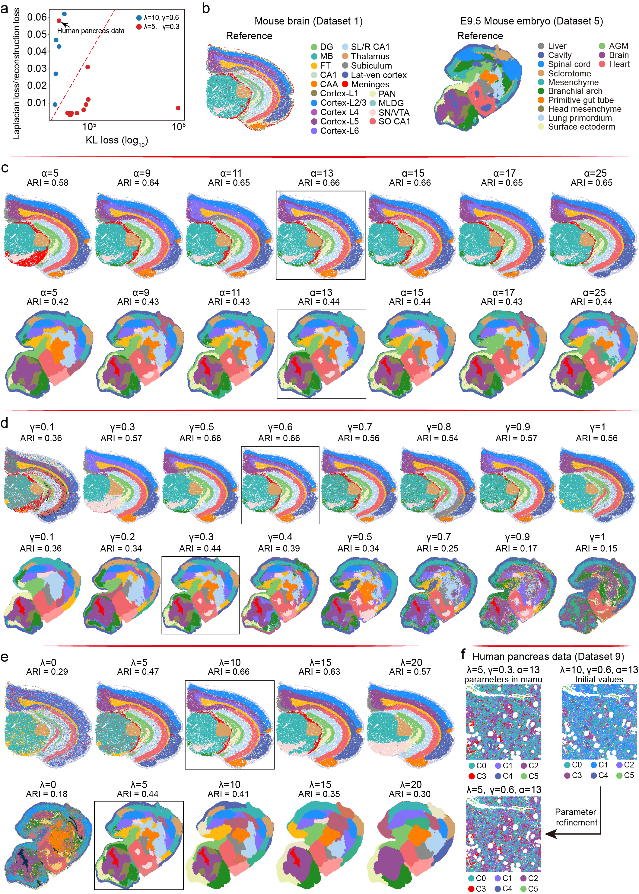

# Parameter Selection

BLEND has three main hyperparameters: α, λ, and γ. To facilitate parameter selection, we provide an automatic parameter selection model that helps users obtain a suitable initial parameter setting. Detailed usage instructions are provided in blend_parameter_guidance.ipynb.

If the automatically predicted parameter setting does not yield satisfactory spatial-domain identification results, the parameters can be further fine-tuned according to the following guidelines:

1. α: BLEND is robust to α over a broad range (α = 9–25), and therefore dataset-specific tuning is generally unnecessary. We recommend using the default value of (α = 13).
2. γ: γ controls the weighting of zero-valued entries and can substantially affect spatial-domain identification. Smaller values of γ may reduce the separability between spatial domains, whereas excessively large values may lead to inappropriate merging of adjacent or similar domains or to diffuse spatial patterns. Therefore, when small or highly similar spatial domains remain difficult to distinguish, γ can be moderately increased.
3. λ: λ regulates the strength of spatial smoothness. Larger values encourage greater consistency among neighboring locations, whereas excessively large values may lead to over-smoothing and blur the boundaries between adjacent spatial domains. Therefore, when neighboring small or similar domains are overly merged, λ can be reduced.

Based on these observations, we recommend a two-step parameter selection strategy. First, users can apply BLEND's automatic parameter selection module to obtain an initial parameter setting. Second, the parameters can be further refined based on the resulting spatial-domain patterns. In particular, if small or highly similar spatial domains remain unresolved, users may reduce λ or increase γ. We validated this strategy on the human pancreas dataset (Dataset 9): the automatic module first selected (λ = 10, γ = 0.6, α = 13), after which reducing λ from 10 to 5 while keeping γ and α unchanged recovered the pancreatic stellate cell (PSC) region.

For guidance on the number of iterations and data preprocessing, please refer to the 2D and 3D examples in the BLEND_manual folder.

# BLEND_manual_data

GSM9046248_Embryo_E8.0_stereo_rep2_spatial.h5ad

scRNA_seq_E80.h5ad

mouse_brain.h5ad

sc_mousebrain.h5ad

Please obtain data through the following link: https://drive.google.com/drive/folders/1wm1Zaw-8SVzz24PbNxUYdb25JBGkxc-I?usp=sharing

