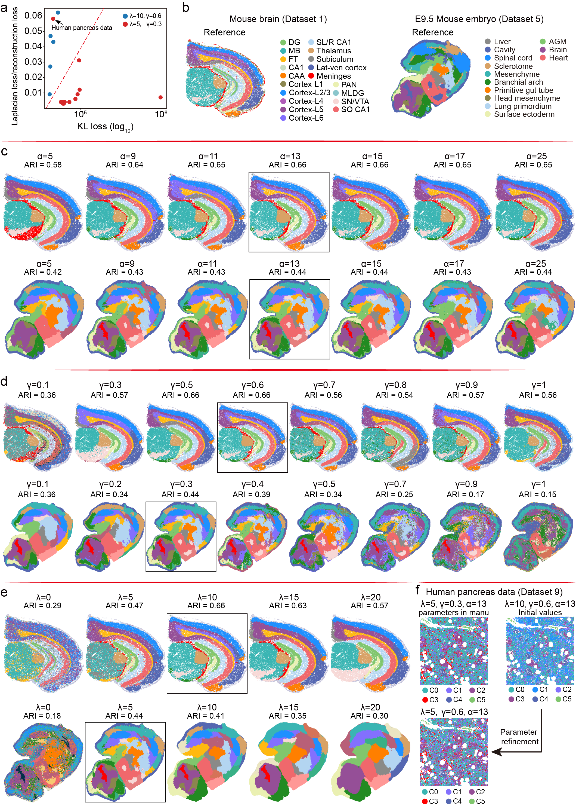

# BLEND Tutorials and Parameter Guidance

This directory provides tutorials and parameter-selection guidance for **BLEND**.  
The notebooks demonstrate how to run BLEND under different data settings and how to select appropriate parameters for your dataset.

## Files

| File | Description |
|------|-------------|
| `blend_3D.ipynb` | Tutorial for applying BLEND to 3D spatial data. |
| `blend_with_singlecell.ipynb` | Tutorial for running BLEND when single-cell reference data are available. |
| `blend_without_singlecell.ipynb` | Tutorial for running BLEND without single-cell reference data. |
| `blend_parameter_guidance.ipynb` | Step-by-step example for parameter selection in BLEND. |
| `BLEND_parameter.png` | Illustration of the BLEND parameter-selection workflow. |
| `parameter_classifier.joblib` | Pre-trained classifier used for parameter recommendation. |

## Parameter Selection

The performance of BLEND may depend on the choice of parameters for different datasets.

For a practical example of parameter selection, please refer to:

👉 [blend_parameter_guidance.ipynb](./blend_parameter_guidance.ipynb)

The overall parameter-selection workflow is illustrated below:

  

## Tutorials

Choose the appropriate tutorial according to your data:

- **3D spatial data:**  
  [blend_3D.ipynb](./blend_3D.ipynb)

- **With single-cell reference data:**  
  [blend_with_singlecell.ipynb](./blend_with_singlecell.ipynb)

- **Without single-cell reference data:**  
  [blend_without_singlecell.ipynb](./blend_without_singlecell.ipynb)

## Recommended Workflow

1. Select the tutorial corresponding to your data type.
2. Prepare the input data following the notebook instructions.
3. Use the parameter-selection guidance to determine appropriate BLEND parameters.
4. Run BLEND and evaluate the results.
5. Adjust the parameters if necessary based on the characteristics of your dataset.

## Notes

The notebooks are intended to provide reproducible examples for using BLEND.  
Users may need to adjust file paths and parameters according to their own datasets.
