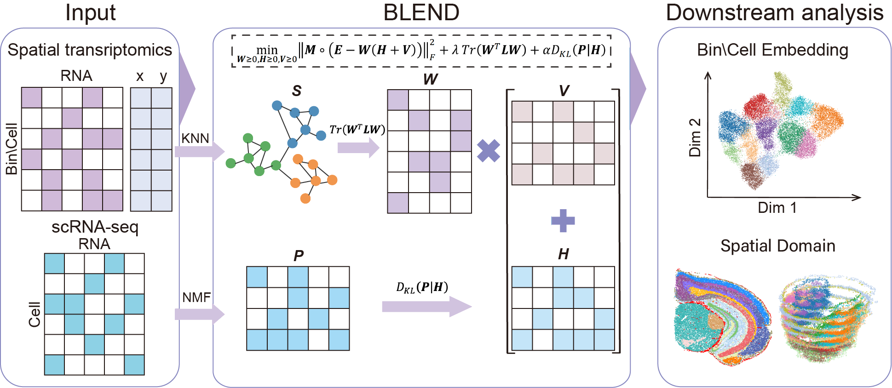

# BLEND
## Introduction
**BLEND** (biased low-rank matrix decomposition incorporating single-cell transcriptomic data) is a method that applies biased low-rank matrix factorization with single-cell transcriptomic guidance to mitigate the impact of noise and jointly model gene expression and spatial coordinates, enabling precise identification of spatial domains in SSRT.



# Installation Guide

## Requirements


BLEND is implemented in Python and requires:

- **Python:** `3.11.9`

**Packages:**
- `numpy` `2.1.3`
- `scanpy` `1.11.0`
- `scikit-learn` `1.5.2`
- `scipy` `1.15.2`
- `torch` `2.6.0`

> **Tip:** Visit the official PyTorch website to obtain the appropriate installation command for your system and CUDA version:  
> https://pytorch.org/get-started/locally/  
> You can check your CUDA version with:
>
> ```bash
> nvcc --version
> ```


For example, create a new environment named blend_demo and activatit.

    conda create -y -n blend_demo python=3.11.9
    conda activate blend_demo

If you would like to install the exact library versions used in our study, you can do so with:

    conda env create -f environment.yml
    conda activate blend_demo

## Installation

BLEND can be installed in two steps:

1. Download the package and unpack it

2. run the code:

        cd $package
        pip install -e .

# Demo

We provide a manual for BLEND usage in the BLEND/ directory inside the BLEND package.

# Tips

If you encounter difficulties downloading our code from GitHub, we recommend downloading it from Zenodo: https://doi.org/10.5281/zenodo.17341055


